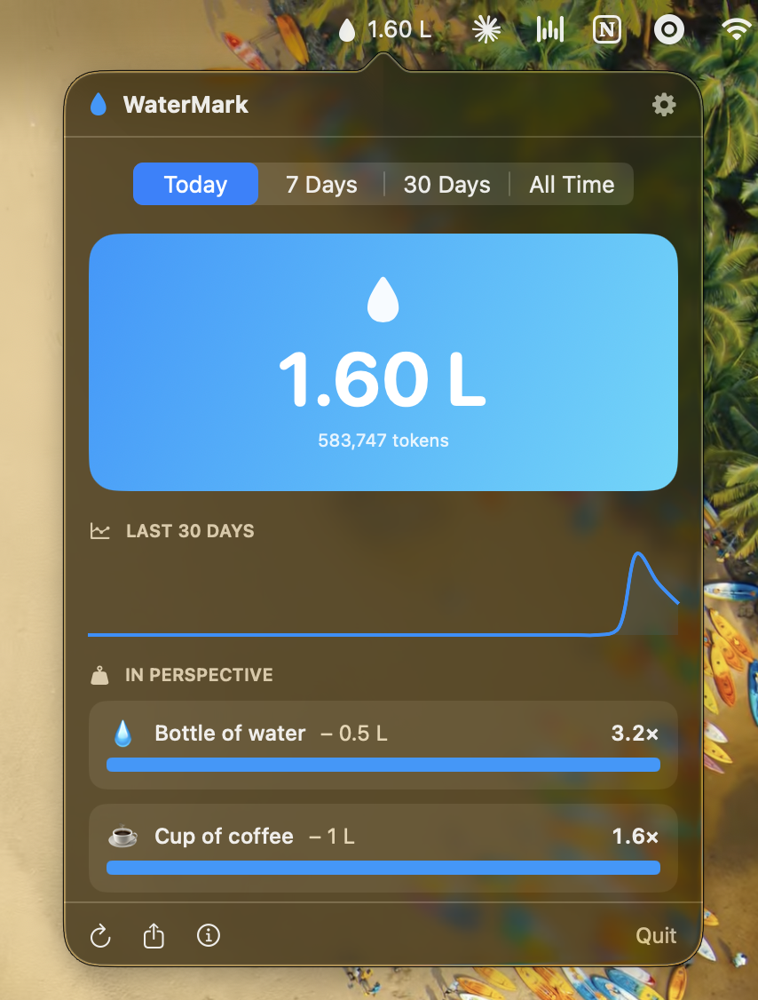
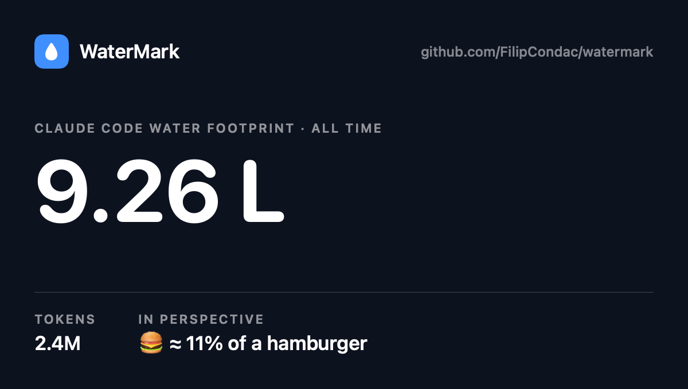

# WaterMark 💧

A macOS menu-bar app that estimates the water footprint of your Claude Code
usage, computed entirely from local transcripts. Nothing leaves your machine.

The menu bar shows your estimated water for the chosen window. Click the
droplet to open a dashboard with everyday-water comparisons, a 30-day trend, a
per-model breakdown, editable coefficients, and a shareable card.

<table align="center">
  <tr>
    <td align="center" valign="middle">
      
    </td>
    <td align="center" valign="middle">
      
    </td>
  </tr>
  <tr>
    <td align="center"><sub>The menu-bar dashboard</sub></td>
    <td align="center"><sub>The one-click share card</sub></td>
  </tr>
</table>

## Why

"AI is drinking the planet dry" is one of the loudest takes around. WaterMark
answers it with the actual number from your own usage, using figures that are
fair, sourced, and deliberately generous, then puts that number next to
everyday things.

The point isn't to wave away AI's footprint. It's to keep it in proportion.
Even with the most comprehensive settings switched on, a whole history of
coding usually lands somewhere around a single shower, and it's a rounding
error next to one hamburger. When the estimate is built to be hard to dismiss
and the number still comes out small, that tells you something.

## Features

- **Dashboard.** Pick Today, 7 days, 30 days, or All time. You get a hero
  figure, the token count behind it, and a 30-day trend chart.
- **In perspective.** Your water alongside everyday items (a bottle, a shower,
  a coffee, a hamburger), each with a bar showing how much of one whole item it
  adds up to. Compared on blue water, the same kind data centres use, so the
  comparison is like-for-like rather than flattering.
- **By model.** Water per model, each with its own editable energy
  coefficients. Unrecognised model families fall back to mid-size defaults and
  say so.
- **Training share (optional).** Your amortised slice of one-time model
  training, in proportion to your own usage (a percentage uplift on inference
  water, default 15%), shown as a separate figure you can toggle off.
- **Shareable card.** One click copies a clean image, complete with the repo
  link, to your clipboard.
- **Sources and settings.** In-app citations, a plain-English methodology, and
  every coefficient laid out and editable, so the estimate stays auditable.

## How it works

- Reads `~/.claude/projects/**/*.jsonl`, the transcripts Claude Code already
  writes.
- Sums tokens per assistant turn, deduped by message id (keeping the line with
  the final output count, since streamed responses log partial counts first),
  then buckets them by local day and by model.
- Converts tokens to energy to water, per model, then sums the result:
  - `energy = output × e_out + (input + cache_creation) × e_prefill +
    cache_reads × e_prefill × 10%` (Wh per 1k tokens). Generating tokens
    (decode) costs roughly 11× more per token than reading them (prefill), so
    the two carry separate coefficients. Cache reads skip recompute but aren't
    free; the 10% default mirrors how they're priced.
  - `water = energy × (WUE_onsite + WUE_source)`. The **comprehensive** scope
    adds the off-site grid-electricity term (~4.35 L/kWh, the US grid
    consumption intensity implied by the LBNL 2024 report) on top of on-site
    cooling (~0.30 L/kWh). Switch it off for the cooling-only number that
    headlines usually quote.
- Energy defaults deliberately sit above published per-token estimates for
  comparable models, leaving headroom for long coding contexts where flat
  per-token rates undercount. Google's 0.24 Wh median Gemini prompt serves as
  an order-of-magnitude cross-check (it publishes no token counts), alongside
  the "How Hungry is AI?" benchmark. Every coefficient is editable under
  Settings.
- Optionally adds your amortised share of model training, in proportion to
  your usage: a percentage uplift on inference water (default 15%, from the
  10–25% overhead implied by inference being 80–90% of fleet-wide AI compute).
  Lifecycle analyses amortise training over usage, never per user.
- Choose which window the menu-bar figure reflects from the segmented control
  at the top of the dashboard. WaterMark re-scans every 60 seconds and only
  re-parses files that have changed.

### Fair comparisons: rainwater vs freshwater

Food water footprints are dominated by **green water** (rain falling on crops
and pasture). Data centres use **blue water** (freshwater from rivers, lakes,
and aquifers). Quoting a burger at its headline 2,400 L against AI's blue
water would flatter AI by about 30×, so the in-app comparisons use blue-water
figures instead: roughly 82 L for a 150 g hamburger and 1 L for a cup of
coffee (Mekonnen & Hoekstra 2012). The bottle and shower comparisons were
already blue water. This is the honest version of the comparison, and the
conclusion survives it.

These are order-of-magnitude estimates, not measurements. Anthropic publishes
no per-token energy or water for Claude, and the biggest unknown is which
region and grid served your requests. See *Sources* in the app for the full
methodology and citations.

## Install

### Homebrew (recommended)

```bash
brew install --cask filipcondac/tap/watermark
```

That's it. The app lands in `/Applications`, and the cask clears the quarantine
flag on install, so it opens with no Gatekeeper warning. Launch it from
Spotlight or Applications, then turn on *Launch at login* from Settings.

**No admin rights?** If you're not an administrator (say, a managed Mac),
installing to `/Applications` will ask for a password. Install into your home
folder instead and no password is needed:

```bash
HOMEBREW_CASK_OPTS="--appdir=~/Applications" brew install --cask filipcondac/tap/watermark
```

### Manual download

Grab `WaterMark.zip` from the [latest release](https://github.com/FilipCondac/watermark/releases/latest),
unzip it, and drag `WaterMark.app` to your Applications folder (`~/Applications`
works without admin rights).

Because the app isn't notarized (there's no paid Apple Developer account),
macOS blocks the **first** launch. Clear it once, either way:

- **No Terminal:** double-click the app, dismiss the warning, then open
  **System Settings → Privacy & Security**, scroll down, and click
  **"Open Anyway"** next to WaterMark. (On macOS 15 and later, the old
  right-click → Open trick no longer bypasses this.)
- **Terminal:** clear the quarantine flag directly.

  ```bash
  xattr -dr com.apple.quarantine ~/Applications/WaterMark.app
  open ~/Applications/WaterMark.app
  ```

> The app **is** code-signed (ad-hoc), so it runs fine on Apple Silicon. These
> steps only clear the one-time "unidentified developer" prompt that
> un-notarized apps trigger. The `brew install` route avoids it entirely.

## Build from source

```bash
./build_app.sh           # compiles, then assembles WaterMark.app
open WaterMark.app
```

Requires macOS 13 or later and a Swift toolchain (Xcode command-line tools).

## Project layout

| File | Purpose |
|------|---------|
| `Sources/WaterMark/Main.swift` | Entry point (accessory app, no Dock icon) |
| `Sources/WaterMark/AppDelegate.swift` | Menu-bar item, popover, and refresh timer |
| `Sources/WaterMark/AppState.swift` | Observable bridge from scanner and model to the views |
| `Sources/WaterMark/UsageScanner.swift` | Transcript parsing, aggregation, and per-file cache |
| `Sources/WaterMark/WaterModel.swift` | Tokens → energy → water model with editable coefficients |
| `Sources/WaterMark/Comparisons.swift` | Everyday-water reference figures |
| `Sources/WaterMark/Views.swift` | SwiftUI dashboard, sources, settings, and share card |
| `Info.plist` | Bundle metadata (`LSUIElement` = menu-bar only) |
| `build_app.sh` | Build script |
</content>
</invoke>
